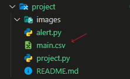
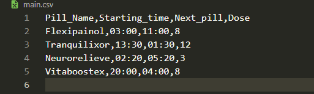

# MedScheduler 💊

#### Video Demo:  <https://youtube.com>
# Description:
*MedScheduler* is a mini terminal program that will remind you when to take your pills according to the input you provide.<br>
i made this specifically because my wife had a surgery not too long ago and they gave her a ton of pills to take on specific times but she always forgets and since i am always on my laptop studying i needed a way to remind her so she don't skip a pill...<br>


## Table of Contents

- [Usage](#Usage)
- [Example](#Example)
- [TaskScheduler set up](#TaskScheduler)

# Usage

## Step one: ( Adding Medication )

- User will be asked to choose one of these 4 options:

	```
		┍━━━━┯━━━━━━━━━━━━━━━━━┑
		│    │ Choices         │
		┝━━━━┿━━━━━━━━━━━━━━━━━┥
		│ 1  │ Add medicine    │
		├────┼─────────────────┤
		│ 2  │ Delete medicine │
		├────┼─────────────────┤
		│ 3  │ Show medicines  │
		├────┼─────────────────┤
		│ Q  │ Quit            │
		┕━━━━┷━━━━━━━━━━━━━━━━━┙
	```
	- **1** : Will be able to add a new Pill reminder:

		```
			* Adding Medicine

			How many medicines are you adding: 1
			Enter medicine name to add: VitaBoostex
			When did you take the first pill (HH:mm): 20:00
		```
		- Now you will get to enter how often you suppose to take this pill
			- Every 8 hours
			- Every 12 hours
			- custom your own time

			```
				┍━━━━┯━━━━━━━━━━━━━━━━┑   
				│    │ Choices        │   
				┝━━━━┿━━━━━━━━━━━━━━━━┥   
				│  1 │ Every 8 Hours  │   
				├────┼────────────────┤   
				│  2 │ Every 12 Hours │   
				├────┼────────────────┤   
				│  3 │ Other          │   
				┕━━━━┷━━━━━━━━━━━━━━━━┙   
				Whats the Dose: 1
				Adding....
				VitaBoostex added, Next pill at 04:00
				
				"""
				check table below to see "VitaBoostex"
				name added at the bottom of the table with
				next pill time calculated
				"""
			```
	- **2** : Will be able to edit a specific input
		- changing pill name :
		```
			┍━━━━┯━━━━━━━━━━━━━━━━━━━┑   
			│    │ Available Edits   │   
			┝━━━━┿━━━━━━━━━━━━━━━━━━━┥   
			│  1 │ Name              │   
			├────┼───────────────────┤   
			│  2 │ Starting time     │   
			├────┼───────────────────┤   
			│  3 │ Dose              │   
			┕━━━━┷━━━━━━━━━━━━━━━━━━━┙   
			What would you like to edit: 1

			Medicine name: Vitaboostex
			New name: panadol

			Name Changed successfully
		```
		- changing the starting time :

		```
			┍━━━━┯━━━━━━━━━━━━━━━━━━━┑
			│    │ Available Edits   │
			┝━━━━┿━━━━━━━━━━━━━━━━━━━┥
			│  1 │ Name              │
			├────┼───────────────────┤
			│  2 │ Starting time     │
			├────┼───────────────────┤
			│  3 │ Dose              │
			┕━━━━┷━━━━━━━━━━━━━━━━━━━┙
			What would you like to edit: 2

			Medicine name: Flexipainol
			New starting time (HH:mm): 03:00

			Starting time Changed successfully
		```
		- changing dose :
		```

		```
	- **3** : Will show all Medications added, with there timing, when you started and when will the next pill be
		```
			* Medicines table
			┍━━━━━━━━━━━━━━┯━━━━━━━━━━━━━━━━━┯━━━━━━━━━━━━━┯━━━━━━━━━━━┑
			│ Pill_Name    │ Starting_pill   │ Next_pill   │    Dose   │
			┝━━━━━━━━━━━━━━┿━━━━━━━━━━━━━━━━━┿━━━━━━━━━━━━━┿━━━━━━━━━━━┥
			│ FlexiPainol  │ 12:44           │ 20:44       │         8 │
			├──────────────┼─────────────────┼─────────────┼───────────┤
			│ Tranquilixor │ 13:30           │ 01:30       │        12 │
			├──────────────┼─────────────────┼─────────────┼───────────┤
			│ NeuroRelieve │ 02:20           │ 05:20       │         3 │
			├──────────────┼─────────────────┼─────────────┼───────────┤
			│ Vitaboostex  │ 20:00           │ 04:00       │         8 │
			┕━━━━━━━━━━━━━━┷━━━━━━━━━━━━━━━━━┷━━━━━━━━━━━━━┷━━━━━━━━━━━┙
		```
	- **Q** = Will Quit the program

- Now after added a reminder if you checked the project file directory a new .csv file showed up with the name "**main.csv**" and this where all your pills / timing will live

	
	- This is the content of the **main.csv** file
	
		

		- Pill_Name = name of the medication
		- Starting_time = time the medication added
		-  ***Next_pill*** <---- *Described below*
		- Dose (How often you take the pill)

	- ***Next_pill*** : <br>As you can see a new column is made with the name "**Next_pill**" which been calculated automatically and added to the file for later use


- This way you will create all your new input and it will be saved and manged to the *CSV* file automatically
<hr>

# TaskScheduler
### Step two: ( Configuring Task scheduler for Windows )
I made a scheduling script using ***schedule*** and ***plyer*** libraries that will ultimately read the csv file created after adding your Medications and parse the output to set specific reminders at specific times and to do so we need to run the script continually.<br>
So i decided to run it automatically on the background at specific time or event.

#### One of the best ways to run a specific script on a specific time is using the build in windows feature (Task Scheduler) and here is how we'll do that

- Go to **start** and search **Task scheduler**
- Press *"Create Task"*

	

- Provide these information:
	- Name for the task
	- Description (Optional)
	- Configure for (according to your system)

		

- Press *"Triggers"* Press *"New"*

	

- Add the needed information according to your task just make sure the **"Enabled"** check box is checked

	

- Press *"Actions"* Press *"New"*

	

- ### Here you need to be very specific:
	- **Program/script** : Add your python.exe path<br>(Run this on your command line) and copy paste the path

		```
			which pythonw
		```
		* i am using *pythonw* to run the script silently you can use normal python but that will trigger a pop up terminal window
	- **Add arguments** : Add your python file path
	- **Start in** : Sometimes you will need to add this ( Parent path ) too<br> do it incase you ended up getting (0x01) Error

		

- Now you have a ready to run task 

	


# Example

- Here is a screenshot of how the notification will look like

	

- Here how the notification bar will look like on missed notifications
	- You can change the **message** or the **title** on the notification bar as you wish, you can even add an icon (As shown)

	
